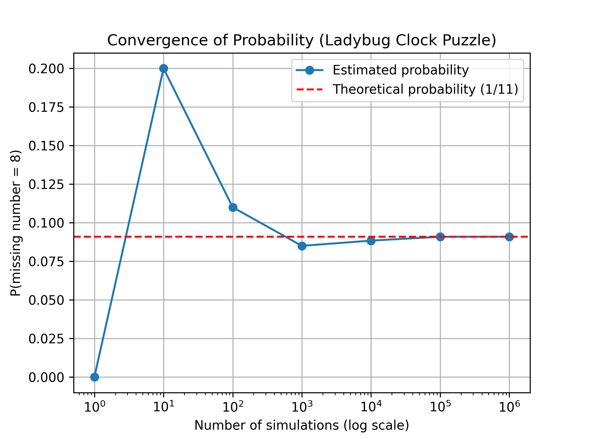
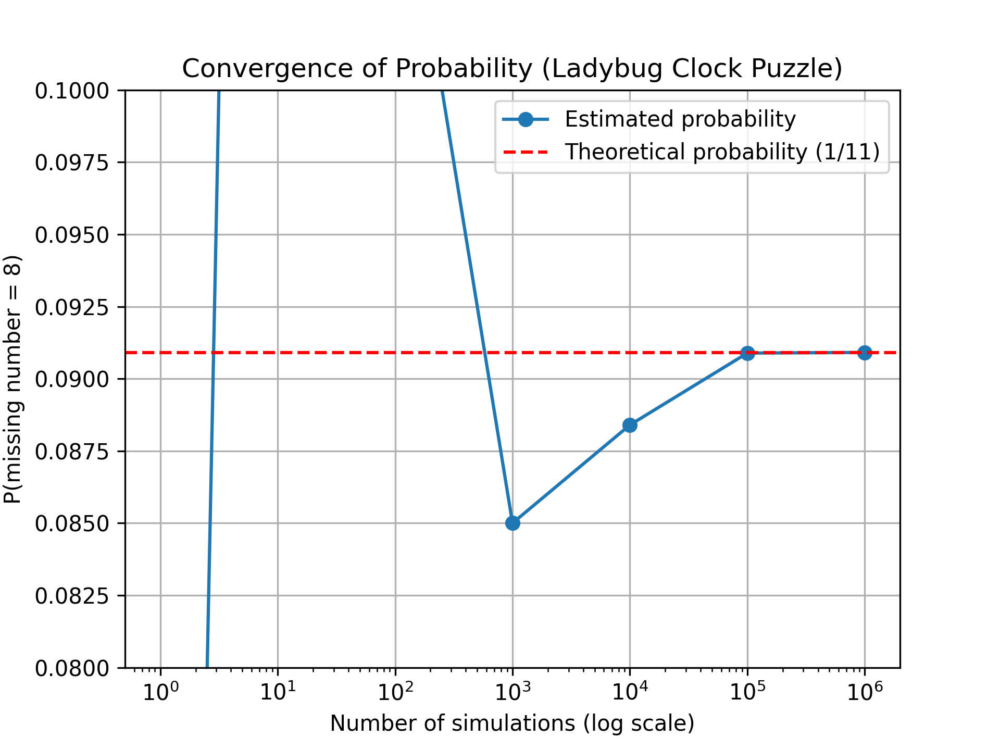

# The Ladybug Clock Puzzle

A ladybug alights on the 12 of a cuckoo clock. Whenever the clock strikes, she moves randomly to a neighboring number (so the first time, she moves to the 1 or the 11 with equal probability). Suppose the ladybug continues this process until she has been to all of the numbers at least once. What is the probability that the last new number she visits is 6?

National Museum of Mathematics. (2026, January). Monthly Mindbenders: January, 2026 [PDF]. MoMath. https://momath.org/wp-content/uploads/2026/01/Monthly-Mindbenders-January-2026.pdf

# The Mathematical Solution

The mathematical solution treats the ladybug’s movement as a random walk and Markov process along the clock. By considering a “run” of consecutive painted numbers, we can reduce the infinite wandering of the ladybug to a finite problem: the probability  p(x) that the ladybug reaches one end of a run before the other satisfies p(x) = x/n, showing that the probability varies linearly along the run. Using this insight, the process can be analyzed as a series of independent probability steps, calculating the chance that each number is visited in a particular order without “wipeouts.” Multiplying these probabilities for each stage shows that the probability the last unvisited number is 6 equals  1/11, consistent with the symmetry of the clock and the Markov chain analysis.

# Using the Monte Carlo Simulation 

In this project, I used Python to create a Monte Carlo simulation of the Ladybug Clock Puzzle estimating the probability that a specific number between 1-11 is missing after the ladybug completes its random moves around a 12-hour clock. 

# The Results 

|    Trials | Probability | Std. Error | Distance to 1/11 |
| --------: | ----------- | ---------- | ---------------- |
|         1 | 0.000000    | 0.000000   | -0.090909        |
|        10 | 0.200000    | 0.126491   | 0.109091         |
|       100 | 0.110000    | 0.031289   | 0.019091         |
|     1,000 | 0.085000    | 0.008819   | -0.005909        |
|    10,000 | 0.088400    | 0.002839   | -0.002509        |
|   100,000 | 0.090890    | 0.000909   | -0.000019        |
| 1,000,000 | 0.090911    | 0.000287   | 0.000002         |

# The Plots 

The plot.py script generates plots at different y-limits to further see the fluctuations between the probability values of each number of trials and compares them to a reference line at y = 1/11, the theoretical probability for the last unvisited number.

Plot at y-limit(0.0899-0.0919)

