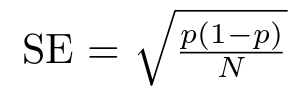

# The Ladybug Clock Puzzle

A ladybug alights on the 12 of a cuckoo clock. Whenever the clock strikes, she moves randomly to a neighboring number (so the first time, she moves to the 1 or the 11 with equal probability). Suppose the ladybug continues this process until she has been to all of the numbers at least once. What is the probability that the last new number she visits is 6?

National Museum of Mathematics. (2026, January). Monthly Mindbenders: January, 2026 [PDF]. MoMath. https://momath.org/wp-content/uploads/2026/01/Monthly-Mindbenders-January-2026.pdf

# The Mathematical Solution

The mathematical solution treats the ladybug’s movement as a random walk and Markov process along the clock. By considering a “run” of consecutive painted numbers, we can reduce the infinite wandering of the ladybug to a finite problem: the probability  p(x) that the ladybug reaches one end of a run before the other satisfies p(x) = x/n, showing that the probability varies linearly along the run. Using this insight, the process can be analyzed as a series of independent probability steps, calculating the chance that each number is visited in a particular order without “wipeouts.” Multiplying these probabilities for each stage shows that the probability the last unvisited number is 6 equals  1/11, consistent with the symmetry of the clock and the Markov chain analysis.

# Using the Monte Carlo Simulation 

The clock.py script performs a simulation to estimate the probability that a specific number, such as 6, is the last number visited by the ladybug. Starting at 12 o’clock, the ladybug moves randomly one step clockwise or counterclockwise at each iteration, and the script tracks which numbers have been visited. Once 11 numbers have been visited, leaving one “missing” number, the script checks whether this number matches the target and updates a counter accordingly. The simulation is repeated for a large number of trials, and at predefined checkpoints, the current estimated probability is calculated and saved to a CSV file (results.txt) for further analysis and visualization. This approach allows the Monte Carlo estimate to converge toward the theoretical probability of 1/11.

# The Results 

The table below shows the estimated probability that a specific number (e.g., 6) is the last visited, calculated using Monte Carlo simulations for increasing numbers of trials. The standard error at each checkpoint was computed using the binomial formula:

where 𝑝 is the estimated probability and N is the number of simulations. Additionally, the table includes the absolute difference between the simulation estimates and the theoretical probability 1/11, which quantifies how close the Monte Carlo results are to the expected value. As the number of trials increases, both the standard error and the absolute difference decrease, demonstrating convergence to the theoretical probability.

|    Trials | Probability | Std. Error | Distance to 1/11 |
| --------: | ----------- | ---------- | ---------------- |
|         1 | 0.000000    | 0.000000   | -0.090909        |
|        10 | 0.200000    | 0.126491   | 0.109091         |
|       100 | 0.110000    | 0.031289   | 0.019091         |
|     1,000 | 0.085000    | 0.008819   | -0.005909        |
|    10,000 | 0.088400    | 0.002839   | -0.002509        |
|   100,000 | 0.090890    | 0.000909   | -0.000019        |
| 1,000,000 | 0.090911    | 0.000287   | 0.000002         |

# The Plots 

The plot.py script generates plots at different y-limits to further see the fluctuations between the probability values of each number of trials and compares them to a reference line at y = 1/11, the theoretical probability for the last unvisited number.

## Plot at y-limit(0.0899-0.0919)

# Convergence of the Monte Carlo Simulation 

As the number of trials increases, the estimated probability for the last unvisited number converges to the theoretical value. In other words, as the number of trials approaches infinity, the Monte Carlo estimate also approaches 1/11. This demonstrates that with a sufficiently large number of simulations, the random-walk behavior of the ladybug aligns closely with the mathematical solution derived from symmetry and Markov chain analysis.
